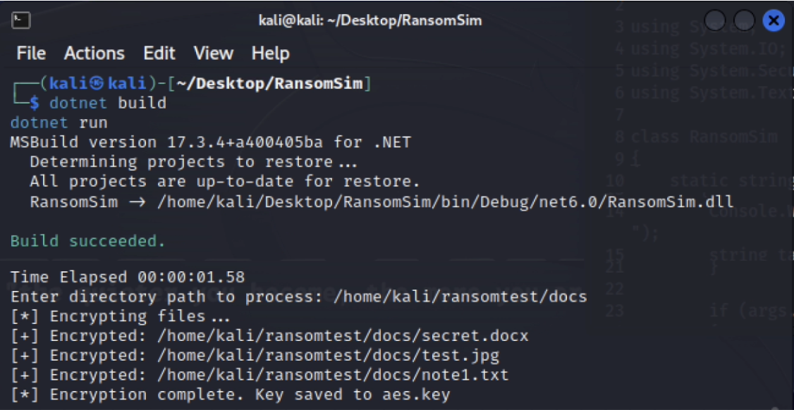

# Folder-Specific Ransomware Simulator

C# console app that simulates ransomware by encrypting and decrypting files in a chosen folder using AES-256.

  

---

## Features

- Encrypts `.txt`, `.docx`, `.jpg` files recursively in specified folder  
- Saves encrypted files with `.enc` extension, deletes originals  
- Stores AES key locally (`aes.key`)  
- Decrypts files with `--decrypt` flag  
- Cross-platform: Windows, macOS, Linux

---

## Usage

1. Build: `dotnet build`  
2. Encrypt: `dotnet run` and enter folder path  
3. Decrypt: `dotnet run -- --decrypt` and enter folder path  

---

## Notes

- For educational use only — test on safe folders  
- Backup files before use 
